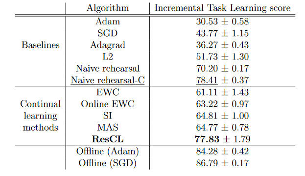

# Continual-Learning-Benchmark Residual continual learning implementation

This is fork of https://github.com/GT-RIPL/Continual-Learning-Benchmark with implemented residual continual learning from https://arxiv.org/abs/2002.06774. Achieved accuarcy was 77.83% on incremental task learning with CIFAR100.

Learning agent for ResCL was implemented in agents/regularization.py in class ResCL and combination of models in models/combined.py

To run ResCL benchmark on CIFAR100 with incremental task as we did, run iBatchLearn.py with this command line parameters:

```
python -u iBatchLearn.py --dataset CIFAR100 --train_aug --gpuid 0 --repeat 1 --optimizer Adam    --force_out_dim 0 --first_split_size 20 --other_split_size 20 --schedule 80 120 160 --batch_size 128 --model_name WideResNet_28_2_cifar --model_type resnet --agent_type regularization --agent_name ResCL  --lr 0.001 --reg_coef 1
```

Inceremtal task results on CIFAR100:

</a>
